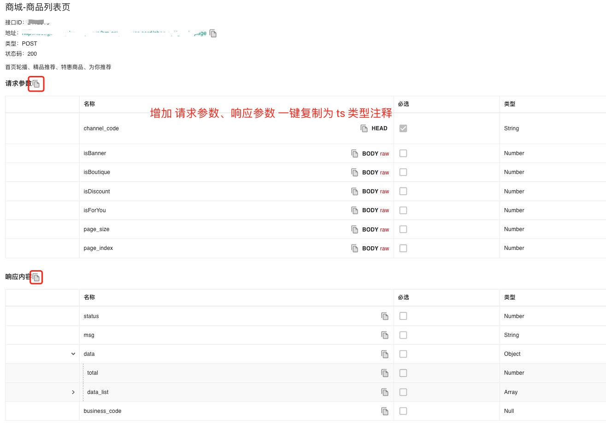
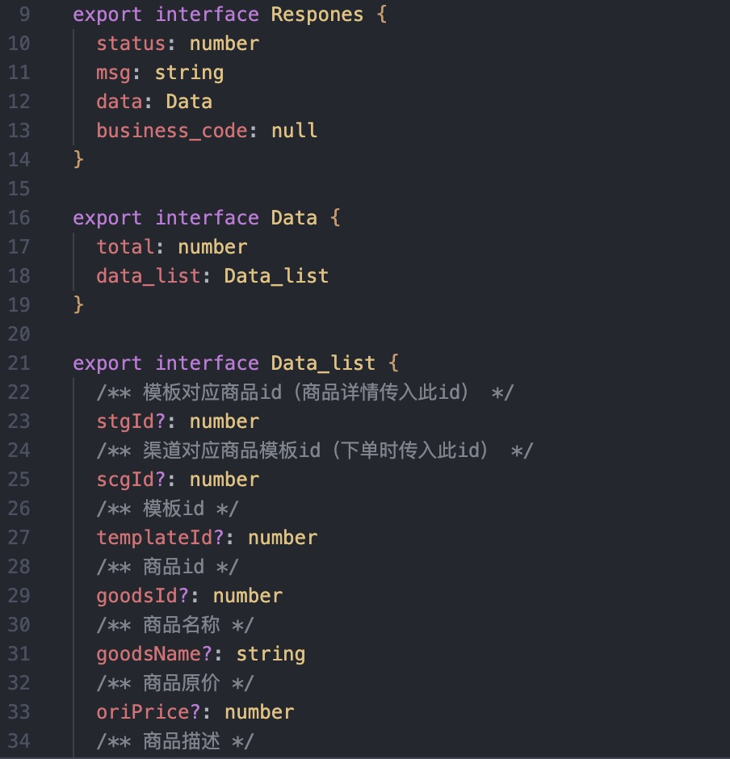

# RAP2-Simple-Ts

> 一个篡改猴 (Tampermonkey)插件

rap2 接口文档一键复制属性列表为 ts 类型标注

### 功能

- 在做 ts 类型标注时麻烦？
- 增加一键复制按钮，将 请求、响应 参数值复制为 ts 标注

### 安装

1. **安装 Tampermonkey 拓展**

到浏览器应用商店搜索，以 Chrome 为例 [Chrome Tampermonkey](https://chrome.google.com/webstore/detail/tampermonkey/dhdgffkkebhmkfjojejmpbldmpobfkfo)

2. **安装 RAP2-Simple-Ts 脚本到 Tampermonkey 并启用**

进入 [GreasyFork (油叉)](<(油叉)>) 搜索脚本 `RAP2 Simple Ts`

### 使用

> 到 rap2 文档，点击复制

